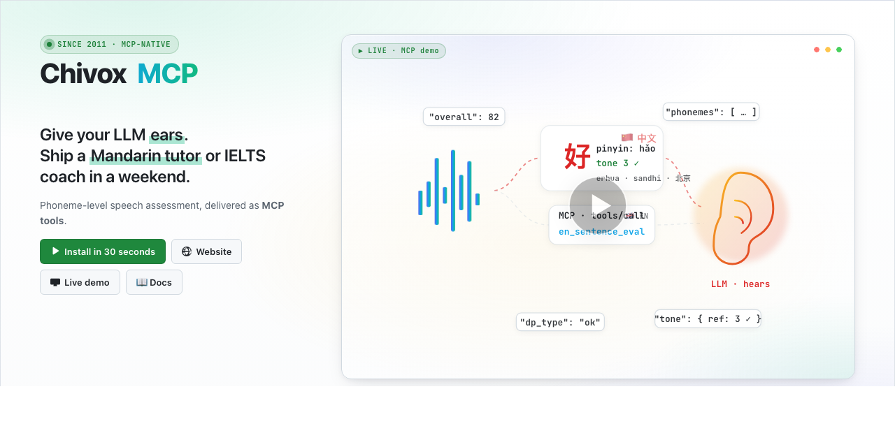

<a href="https://boyzhong123.github.io/mcp22/">
  
</a>

<div align="center">

<a href="#-quickstart"></a>
<a href="https://boyzhong123.github.io/mcp22/"></a>
<a href="https://chivoxmcp2.netlify.app/global"></a>

<br/><br/>


<br/><br/>

<table>
  <tr>
    <td align="center"><b>9.2B+</b><br/><sub>Evals / year</sub></td>
    <td align="center"><b>185</b><br/><sub>Countries</sub></td>
    <td align="center"><b>95%+</b><br/><sub>Human agreement</sub></td>
    <td align="center"><b>&lt; 200ms</b><br/><sub>P99 first token</sub></td>
  </tr>
</table>

<br/>

🎬 **[Watch the 15s demo →](https://18ks.chivoxapp.com/doc/video20260424.mp4)**

</div>

---

> **TL;DR** — LLMs can't hear audio. Chivox MCP gives them ears: one tool call returns `overall / accuracy / fluency / phonemes[]` — a structured JSON your model can reason over directly. No SDK wrapping, no feature extraction, no glue code.

---

## 🎯 Is this for you?

|  ✅ Use Chivox if you…                                                                  |  ❌ You probably want…                                                     |
| :--------------------------------------------------------------------------------------- | :-------------------------------------------------------------------------- |
| Are building an **AI tutor, language app, or reading-aloud** product                     | …**Whisper / Deepgram / AssemblyAI** for plain transcription               |
| Need to know **how well** someone spoke — not **what** they said                         | …**ElevenLabs / OpenAI TTS** for generating speech                         |
| Want **Mandarin** assessment that actually hears tones, erhua, sandhi                    | …**Azure / AWS** for compliance / content moderation                       |
| Ship through **MCP clients** (Cursor / Claude / Agents SDK / LangChain)                  | …**Picovoice / Rhino** for keyword spotting on-device                      |

> Most production teams run **Whisper + Chivox together**: Whisper to transcribe what was said, Chivox to score how well. They don't compete.

---

## 🚀 Quickstart

Pick your stack. All paths speak the same MCP protocol.

<details>
<summary><b>🐍 Python</b> &nbsp;<sub>(recommended)</sub></summary>

```python
import asyncio
from mcp.client.streamable_http import streamablehttp_client
from mcp import ClientSession

async def main():
    async with streamablehttp_client(
        "https://speech-eval.site/mcp",
        headers={"Authorization": "Bearer $CHIVOX_API_KEY"},
    ) as (r, w, _):
        async with ClientSession(r, w) as s:
            await s.initialize()
            out = await s.call_tool("en_sentence_eval", {
                "reference_text": "The weather is gorgeous today.",
                "audio_url":      "https://demo.com/take-01.mp3",
            })
            print(out)

asyncio.run(main())
```

</details>

<details>
<summary><b>cURL</b> &nbsp;<sub>(instant try · no signup)</sub></summary>

```bash
# Hello world — get a score in one call, no API key
curl https://speech-eval.site/mcp/try \
  -H "Content-Type: application/json" \
  -d '{"ref_text":"你好","audio_url":"https://demo.chivox.com/nihao.mp3"}'
```

Example response:

```json
{ "overall": 82, "tones": [3, 3], "verdict": "native-like" }
```

</details>

<details>
<summary><b>LangChain</b> &nbsp;<sub>(Python, 0.3+)</sub></summary>

```python
from langchain_mcp_adapters.client import MultiServerMCPClient
from langgraph.prebuilt import create_react_agent
from langchain_openai import ChatOpenAI

client = MultiServerMCPClient({
    "chivox": {
        "transport": "streamable_http",
        "url": "https://speech-eval.site/mcp",
        "headers": {"Authorization": "Bearer $CHIVOX_API_KEY"},
    }
})
tools = await client.get_tools()   # auto-discovers all 16 tools

agent = create_react_agent(ChatOpenAI(model="gpt-4o"), tools)

await agent.ainvoke({"messages": [
    ("user", "Score my Mandarin: https://demo.com/nihao.mp3. Ref: 你好")
]})
```

</details>

<details>
<summary><b>OpenAI Agents SDK</b></summary>

```python
from agents import Agent, Runner
from agents.mcp import MCPServerStreamableHttp

async with MCPServerStreamableHttp(
    params={"url": "https://speech-eval.site/mcp",
            "headers": {"Authorization": "Bearer $KEY"}},
) as chivox:
    coach = Agent(
        name="Mandarin Coach",
        model="gpt-4o",
        instructions="You are a warm, patient Beijing-accent tutor. "
                     "Score learner audio via Chivox, then give feedback "
                     "+ a targeted drill.",
        mcp_servers=[chivox],
    )
    result = await Runner.run(coach, input="Grade this: ...")
    print(result.final_output)
```

</details>

<details>
<summary><b>Node.js / TypeScript</b></summary>

```ts
import { Client } from '@modelcontextprotocol/sdk/client';

const chivox = await Client.connect({ name: 'chivox' });

const result = await chivox.callTool('en_sentence_eval', {
  reference_text: 'The weather is gorgeous today.',
  audio_url:      'https://demo.com/take-01.mp3',
});

console.log(result.overall);   // 72
console.log(result.details);   // per-word + phonemes
```

</details>

<details>
<summary><b>Cursor</b></summary>

```json
// ~/.cursor/mcp.json
{
  "mcpServers": {
    "chivox": {
      "type": "streamable-http",
      "url":  "https://speech-eval.site/mcp",
      "env":  { "CHIVOX_API_KEY": "sk_live_…" }
    }
  }
}
```

</details>

<details>
<summary><b>Claude Desktop</b></summary>

```json
// ~/Library/Application Support/Claude/claude_desktop_config.json
{
  "mcpServers": {
    "chivox": {
      "command": "npx",
      "args": ["-y", "@chivox/mcp"],
      "env": { "CHIVOX_API_KEY": "sk_live_…" }
    }
  }
}
```

</details>

> **Prefer zero config?** Run `npx @chivox/mcp init` — it detects your MCP client and writes the right config file for you.

---

## ⚖️ How it compares

Chivox MCP is **not** a transcription API. It's a speech-**assessment** API — it scores how well words were pronounced, at the phoneme level.

|                                | Whisper / Deepgram | ElevenLabs | Azure Pronunciation | **Chivox MCP**      |
| ------------------------------ | :----------------: | :--------: | :-----------------: | :-----------------: |
| What it does                   | audio → text       | text → audio | scores EN only    | **scores EN + 中文** |
| Per-phoneme IPA scores         | —                  | —          | ✓                  | **✓**               |
| Mandarin tones (T1-T4)         | —                  | —          | basic              | **✓ native**        |
| Erhua / sandhi / Beijing       | —                  | —          | —                  | **✓**               |
| Stress position (noun vs verb) | —                  | —          | ✓                  | **✓**               |
| MCP-native                     | —                  | —          | —                  | **✓**               |
| Built for agents & tutors      | transcription      | voice      | MS-only stack     | **✓ purpose-built** |

> **Rule of thumb** — use **Whisper** to know *what* was said; use **Chivox** to know *how well*. They stack.

---

## 🧠 What the LLM actually sees

Every Chivox MCP call returns a typed JSON payload. Here's a real response for the sentence *"I want to record a record"*:

```json
{
  "overall": 72,
  "pron":    { "accuracy": 65, "integrity": 95, "fluency": 85, "rhythm": 70 },
  "fluency": { "overall": 85, "pause": 12, "speed": 132 },
  "audio_quality": { "snr": 22.0, "clip": 0, "volume": 2514 },
  "details": [
    {
      "word": "record", "score": 58, "dp_type": "mispron",
      "start": 1100, "end": 1680,
      "stress": { "ref": 2, "score": 45 },
      "accent": "us",
      "phonemes": [
        { "ipa": "ɹ", "score": 45, "dp_type": "mispron" },
        { "ipa": "ɪ", "score": 78, "dp_type": "normal"  }
      ]
    }
  ]
}
```

> **Why this matters** — your LLM doesn't need to know signal processing. The JSON *names* the problem (`dp_type: "mispron"`, `stress.score: 45`) so a vanilla `chat.completion` can explain *why* the learner got it wrong and generate a targeted drill.

---

## 🔁 The three-stage loop

🎤 **Input:** 1-minute learner recording → **Output:** warm feedback + targeted drill, end-to-end in &lt; 3 seconds.

| 01 · MCP assessment | → | 02 · LLM feedback | → | 03 · LLM practice |
| :------------------ | :-: | :-------------- | :-: | :---------------- |
| *Chivox engine*     |    | *chat.completion #1*|| *chat.completion #2* |
| Scores word-by-word & phoneme-by-phoneme. 20+ fields: accuracy · fluency · rhythm · stress · tone · timestamps. | | Groups errors by `dp_type`, explains *why* they happen, prioritizes by severity. | | Auto-generates tongue twisters, minimal-pair drills, a 7-day plan. |

Compatible with **GPT · Claude · Gemini · DeepSeek · Llama · Mistral · Qwen · GLM** — any model that speaks function calling.

---

## 🏮 The moat: a tireless Beijing-accent tutor

There are **30M+** foreigners and 2nd-gen diaspora learning Mandarin worldwide — and **zero** English-speaking platforms that can actually hear the difference between `mā / má / mǎ / mà`. Chivox's Chinese engine is trained on the same data powering China's Putonghua proficiency exam (普通话水平测试).

Your learner says `"wǒ hěn hǎo"`. Chivox returns per-character IPA, **tone confidence distributions**, and millisecond timestamps. Your LLM writes back, in-character:

> *"Close! Your third tone on 好 dipped, but you ended at tone 4 — here's the dipping glide, try again."*

- **Tones + neutral tone** — not a retrofit; trained natively.
- **Erhua (儿化) & sandhi** — the stuff Google STT flattens.
- **Hanzi + Pinyin dual paths** — HSK-aligned vocabulary level.
- **Beijing / Taiwan / neutral** reference accents available.

---

## 🇬🇧 And yes — exam-grade English too

Same engine powering China's national Putonghua exam — aligned to **IELTS · TOEFL · K-12 gaokao · Cambridge YLE** for English. Same MCP endpoints, same 20+ fields. Just a different `ref_text` and `accent`.

- **Phoneme-level IPA** — every `/θ/ /ɹ/ /æ/ /ʃ/` individually scored.
- **Stress & rhythm** — catches noun-vs-verb stress errors (*record, present, import*).
- **Liaison & connected speech** — typed as `ok / none / wrong`.
- **US / UK / AU / neutral** accent references — pick per tool call.

---

## 🛠️ Tools catalog

<details>
<summary><b>English (10 tools)</b></summary>

| Tool                      | Purpose                                      | Modes          |
| ------------------------- | -------------------------------------------- | -------------- |
| `en_word_eval`            | Word pronunciation + phonemes                | file · stream  |
| `en_word_correction`      | Missing / extra / mispron detection          | file           |
| `en_vocab_eval`           | Vocabulary list (batch)                      | file           |
| `en_sentence_eval`        | Sentence accuracy + fluency                  | file · stream  |
| `en_sentence_correction`  | Per-word error detection + tips              | file           |
| `en_paragraph_eval`       | Paragraph reading                            | file · stream  |
| `en_phonics_eval`         | Phonics rules mastery                        | file           |
| `en_choice_eval`          | Spoken multiple-choice                       | file           |
| `en_semi_open_eval`       | Semi-open dialog                             | file · stream  |
| `en_realtime_eval`        | Real-time sentence-by-sentence               | stream         |

</details>

<details>
<summary><b>Mandarin Chinese (6 tools)</b></summary>

| Tool                   | Purpose                        | Modes          |
| ---------------------- | ------------------------------ | -------------- |
| `cn_word_raw_eval`     | Hanzi pronunciation            | file · stream  |
| `cn_word_pinyin_eval`  | Pinyin accuracy + tones        | file           |
| `cn_sentence_eval`     | Word / sentence reading        | file · stream  |
| `cn_paragraph_eval`    | Paragraph reading              | file           |
| `cn_rec_eval`          | Bounded-branch recognition     | file           |
| `cn_aitalk_eval`       | Open Mandarin conversation     | stream         |

</details>

**Input:** `audio_url` · `audio_base64` · `audio_file_path`. **Formats:** mp3 · wav · ogg · m4a · aac · pcm.

---

## 🔌 Dual transport

|           | 🎙️ Streaming                                 | 📁 Batch file                                 |
| --------- | --------------------------------------------- | --------------------------------------------- |
| Best for  | Live coaching, classroom shadowing, real-time | UGC QA, recorded lessons, bulk jobs           |
| Transport | WebSocket — 30-50% lower latency              | HTTP upload (URL / base64 / file path)        |
| Input     | PCM 16k/16-bit/mono chunks (200 ms)           | mp3 · wav · ogg · m4a · aac · pcm             |
| Reconnect | 60 s `resume_token`                           | n/a                                           |

---

## 💎 Why developers ship with Chivox MCP

1. 👂 **Beijing-accent private tutor, 24/7** — a tireless native-accent Mandarin tutor for **30M+** overseas Chinese learners & heritage speakers. Tones, erhua, sandhi — natively handled.
2. ⚡ **Drop-in integration** — one block of JSON, 30 seconds. Every MCP-aware client auto-discovers all 16 tools.
3. 📊 **Data-rich payload for LLMs** — 20+ structured fields per call. An LLM can diagnose *why*, not just *what*.
4. 🇬🇧 **Exam-grade English too** — same engine aligned to IELTS / TOEFL / K-12. Phoneme-level English works out of the box.

Plus: **realtime + batch** modes · **TLS 1.2+ · ISO 27001** · on-prem SKUs · per-phoneme ms timestamps for jump-to-playback · ephemeral audio (destroyed post-scoring).

---

## 💳 Pricing & limits

Straight-forward pricing. Start free, no credit card. Failed calls are **not** billed.

|                | **Free**                    | **Pro · Most popular**                         | **Enterprise**               |
| -------------- | --------------------------- | ---------------------------------------------- | ---------------------------- |
|                | ¥0 forever                  | ¥99 /mo (~$14) · 14-day trial                  | Custom                       |
| Quota          | 1,000 / mo                  | 50,000 / mo                                    | Unlimited                    |
| Concurrency    | 2                           | 10                                             | 50+                          |
| Tools          | 3 core                      | All 7 + LLM 100/mo                             | All + custom                 |
| Overage        | —                           | ¥0.003 / call                                  | negotiated                   |
| SLA            | —                           | 99.5%                                          | 99.9%+                       |
| Support        | GitHub Issues               | Email · 48h                                    | 7×24 dedicated               |

> Single starter key includes **30 calls/day** (≈ 900 total) to test-drive without signup friction. Full breakdown on the [pricing page →](https://chivoxmcp2.netlify.app/global).

---

## ❓ FAQ

<details>
<summary>How is this different from Whisper / Deepgram / AssemblyAI?</summary>

Those are transcription APIs — they tell you *what* was said. Chivox tells you *how well* it was said, at the phoneme level, with the exact field names an LLM needs to diagnose and correct. Most users run both in the same pipeline.

</details>

<details>
<summary>Does it work offline / on-prem?</summary>

Yes. The Enterprise plan ships the same engine as a signed Docker image (x86_64 / ARM64) with an offline license. No data leaves your VPC.

</details>

<details>
<summary>How are failed requests billed?</summary>

They aren't. Billing is per successful assessment. Concurrency packs are sold separately to smooth traffic peaks.

</details>

<details>
<summary>Which languages are planned?</summary>

EN and Mandarin ship today. Spanish, Japanese, and Korean are on the 2026 roadmap.

</details>

<details>
<summary>Can I pin to a specific engine version?</summary>

Yes. Set `X-Chivox-Engine` to a pinned tag (e.g. `en-2024.11`); otherwise you auto-follow the stable channel.

</details>

---

## 🤝 Contributing

Issues and PRs welcome. For substantive features, open a design issue first. Small doc / example fixes can go straight to PR.

```bash
git clone https://github.com/boyzhong123/mcp22.git
cd mcp22
pnpm install
pnpm test
```

---

## 📜 License

Apache-2.0 © 2026 Suzhou Chivox Information Technology Co., Ltd.

---

<div align="center">
  <sub>Made by <b>Chivox</b> · Since 2011 in speech AI</sub><br/>
  <a href="https://chivoxmcp2.netlify.app/global">Website</a> ·
  <a href="https://chivoxmcp2.netlify.app/global/demo">Demo</a> ·
  <a href="https://chivoxmcp2.netlify.app/global/docs">Docs</a> ·
  <a href="https://boyzhong123.github.io/mcp22/">Full design preview</a>
</div>
