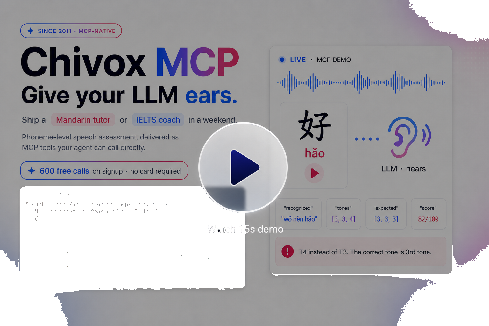
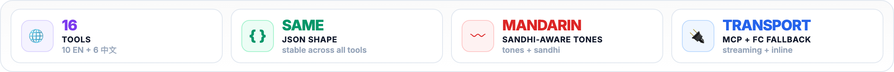
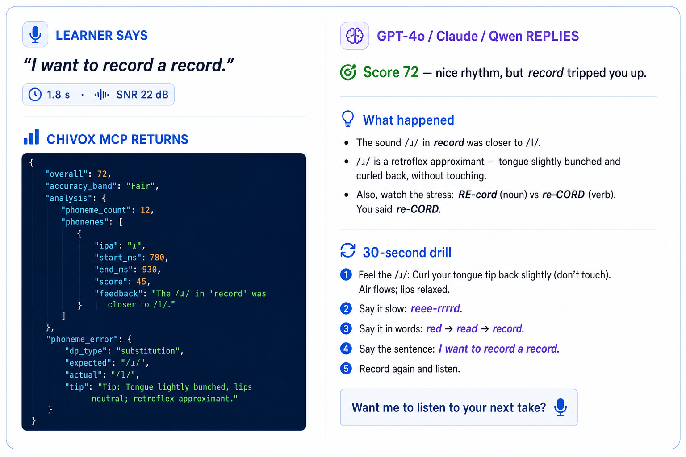
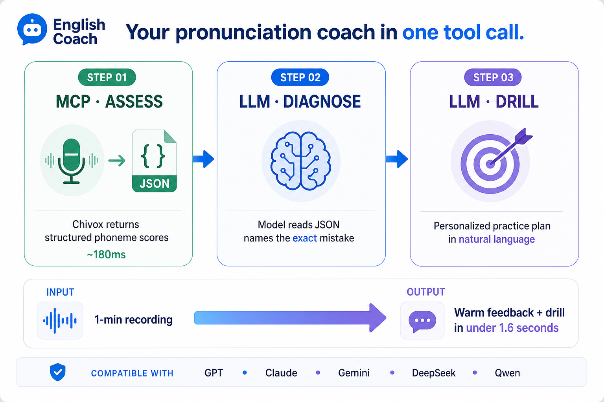
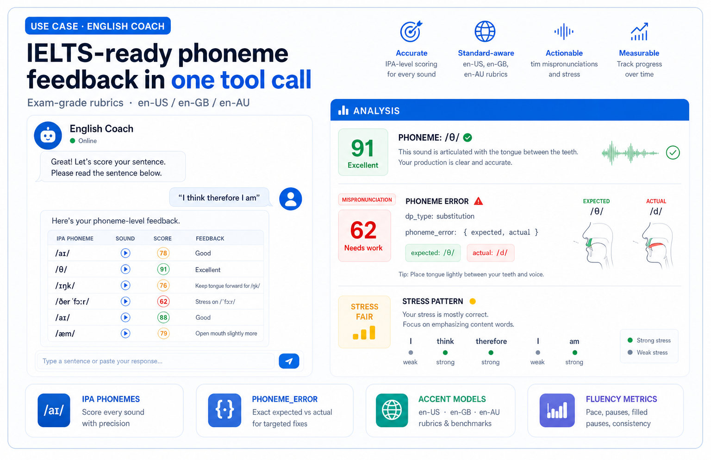
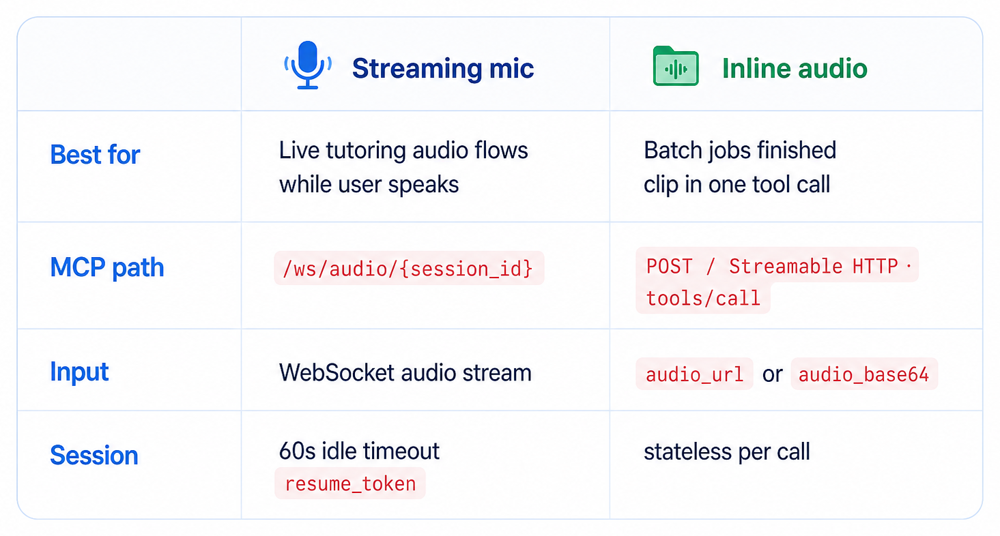
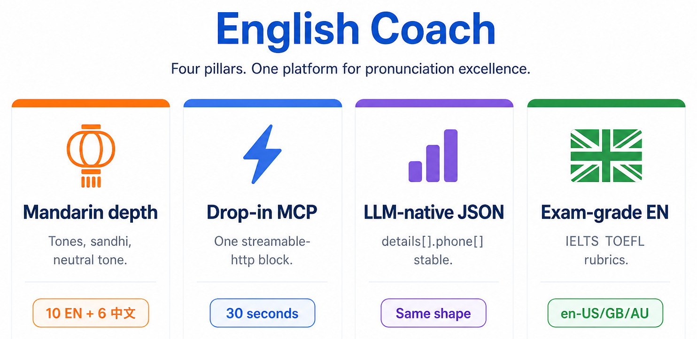
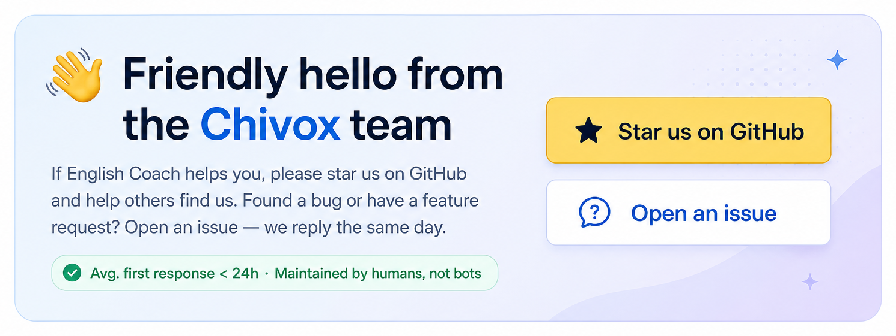

<p align="center">
  <a href="./assets/chivox-mcp.mp4" title="▶ Play product demo">
    
  </a>
</p>

<div align="center">

<a href="https://api-portal.cloud.chivox.com/docs"></a>
&nbsp;
<a href="#-quickstart"></a>

<br/>


<br/>



</div>

**On this page:** [Fit check](#-is-this-for-you) · [Quickstart](#-quickstart) · [Compare](#️-how-it-compares) · [FAQ](#-faq) · [Response JSON](#-what-the-llm-actually-sees) · [Coach loop](#-the-three-stage-loop) · [Tools](#️-tools-catalog) · [Transport](#-dual-transport) · [Pricing](#-pricing)

---

> **TL;DR** — LLMs can't hear audio. **Chivox MCP** is a hosted MCP server that scores pronunciation at the phoneme level — Mandarin tones included. One `tools/call` returns `overall / accuracy / pron / fluency / details[].phone[]` (pronunciation, fluency, per-phoneme breakdown) in a stable JSON shape your model can reason over. Not STT. Not a Whisper wrapper.

> 📖 **Canonical reference:** [api-portal.cloud.chivox.com/docs](https://api-portal.cloud.chivox.com/docs) — endpoints, tool catalog, response fields, limits, and client configs.

> 🛠️ **Running this website repo locally?** See [`docs/deploy/README.md`](./docs/deploy/README.md) or paste [`docs/deploy/quickstart-prompt.md`](./docs/deploy/quickstart-prompt.md) into your agent.

---

## 🎯 Is this for you?

<p align="center">
  
</p>

> Most production teams run **Whisper + Chivox together**: Whisper to transcribe what was said, Chivox to score how well. They don't compete.

---

## 🚀 Quickstart

Hosted endpoint: **`https://mcp-global.cloud.chivox.com`** · every request needs `Authorization: Bearer <api_key>`. [Get a key →](https://api-portal.cloud.chivox.com)

| Client | Setup |
|--------|-------|
| [**Cursor**](#cursor-zero-install) | `~/.cursor/mcp.json` — IDE MCP, zero install |
| [**LangChain**](#langchain) | LangGraph ReAct agent + MCP adapter |
| [**OpenAI Agents SDK**](#openai-agents-sdk) | `agents.mcp.MCPServerStreamableHttp` |
| [**Claude Desktop**](#claude-desktop) | Local proxy for mic streaming |
| [**Raw MCP SDK**](#raw-mcp-sdk) | Direct `mcp` Python client |

### Cursor _(zero install)_

```json
// ~/.cursor/mcp.json
{
  "mcpServers": {
    "chivox-speech-eval": {
      "type": "streamable-http",
      "url": "https://mcp-global.cloud.chivox.com",
      "headers": { "Authorization": "Bearer <your_api_key>" }
    }
  }
}
```

### LangChain

```python
from langchain_mcp_adapters.client import MultiServerMCPClient
from langgraph.prebuilt import create_react_agent

client = MultiServerMCPClient({
    "chivox": {
        "transport": "streamable_http",
        "url": "https://mcp-global.cloud.chivox.com",
        "headers": {"Authorization": "Bearer <your_api_key>"},
    }
})
tools = await client.get_tools()  # discovers all 16 tools

agent = create_react_agent("openai:gpt-4o-mini", tools)
result = await agent.ainvoke({"messages": [(
    "user",
    "Score https://example.com/audio/sentence.mp3, ref: I think therefore I am",
)]})
```

### OpenAI Agents SDK

```python
from agents import Agent, Runner
from agents.mcp import MCPServerStreamableHttp

chivox = MCPServerStreamableHttp(
    params={
        "url": "https://mcp-global.cloud.chivox.com",
        "headers": {"Authorization": "Bearer <your_api_key>"},
    },
    name="chivox-speech-eval",
)

async with chivox:
    agent = Agent(
        name="coach",
        instructions="Professional speaking coach",
        mcp_servers=[chivox],
    )
    r = await Runner.run(
        agent,
        "Score https://example.com/audio/sentence.mp3, ref: I think therefore I am",
    )
    print(r.final_output)
```

### Claude Desktop _(mic streaming via local proxy)_

```bash
npm install -g chivox-local-mcp
```

```json
// ~/Library/Application Support/Claude/claude_desktop_config.json
{
  "mcpServers": {
    "chivox": {
      "command": "chivox-local-mcp",
      "env": {
        "MCP_REMOTE_URL": "https://mcp-global.cloud.chivox.com",
        "MCP_API_KEY": "<your_api_key>"
      }
    }
  }
}
```

### Raw MCP SDK

```python
import asyncio
from mcp.client.streamable_http import streamablehttp_client
from mcp import ClientSession

async def main():
    async with streamablehttp_client(
        "https://mcp-global.cloud.chivox.com",
        headers={"Authorization": "Bearer <your_api_key>"},
    ) as (r, w, _):
        async with ClientSession(r, w) as s:
            await s.initialize()
            out = await s.call_tool("en_sentence_eval", {
                "ref_text": "I think therefore I am",
                "audio_url": "https://example.com/audio/sentence.mp3",
            })
            print(out)

asyncio.run(main())
```

> More clients (Claude Code, Windsurf, Zed, Mastra, function-calling mode) → [docs → Clients](https://api-portal.cloud.chivox.com/docs)

---

## ⚖️ How it compares

> **Rule of thumb** — use **Whisper** to know *what* was said; use **Chivox** to know *how well*. They stack.

<p align="center">
  
</p>

---

## ❓ FAQ

### Is this just another wrapper around Whisper?

No. Whisper transcribes; Chivox scores. The engine is trained on exam-graded samples and returns phoneme-level `details[].phone[]` — not a transcript. Most teams run both.

### Does it work offline / on-device?

The hosted MCP server needs outbound access to the scoring engine. For air-gapped deployments, contact us — we ship an on-prem container for enterprise customers.

### What about dialects and accents?

Mandarin targets standard Pǔtōnghuà with sandhi-aware tone verdicts. English supports en-US, en-GB, and en-AU rubrics via locale parameters on the relevant tools.

### Which LLMs work out of the box?

Any model with OpenAI-style function calling: GPT-4o / 5.x, Claude Sonnet / Opus, Gemini, DeepSeek, GLM, Kimi, Doubao, Qwen. Tool schemas are forwarded verbatim.

### Can I use this in a browser?

For quick demos, yes — but production traffic should flow through your backend so the API key stays server-side. [Privacy notes →](https://api-portal.cloud.chivox.com/docs)

---

## 🧠 What the LLM actually sees

Every tool returns the **same top-level shape** — switch locale or granularity with zero schema work. Example for *"hello"*:

```json
{
  "overall": 85,
  "accuracy": 82,
  "pron": 88,
  "integrity": 95,
  "fluency": { "overall": 78, "speed": 65, "pause": 2 },
  "details": [
    {
      "char": "hello",
      "score": 85,
      "phone": [
        { "phoneme": "h",  "score": 90, "dp_type": "normal" },
        { "phoneme": "ɛ",  "score": 82, "dp_type": "normal" },
        { "phoneme": "l",  "score": 88, "dp_type": "normal" },
        { "phoneme": "oʊ", "score": 80, "dp_type": "normal" }
      ]
    }
  ]
}
```

For English mispronunciations, `phoneme_error: { expected, actual }` is included. Mandarin adds `tone_ref` / `tone_detected` with sandhi-aware `dp_type` verdicts. [Full field list →](https://api-portal.cloud.chivox.com/docs)

---

## 💬 …and here's what your LLM does with it

Pipe that JSON straight into any chat model with a one-line system prompt — *"You are a warm pronunciation coach. Diagnose, then drill."* — and you get a real lesson back. **No fine-tuning. No audio understanding. Just `chat.completion`.**

<p align="center">
  
</p>

> **Why this works** — the LLM never "heard" the audio. The JSON *names* the problem in fields it already understands (`dp_type: "mispron"`, `phoneme_error.actual`, `tone_ref` vs `tone_detected`), so a vanilla `chat.completion` can diagnose like a human teacher.

---

## 🔁 The three-stage loop

🎤 **Input:** 1-minute learner recording → **Output:** warm feedback + targeted drill, end-to-end in &lt; 1.6 seconds.

<p align="center">
  
</p>

<div align="center"><sub>Compatible with <b>GPT · Claude · Gemini · DeepSeek · Llama · Mistral · Qwen · GLM</b> — any model with tool / function-calling support.</sub></div>

---

## 🏮 The moat: a tireless Mandarin tutor

**30M+** learners worldwide study Mandarin — including heritage speakers and adult beginners — yet few platforms score tone errors (`mā / má / mǎ / mà`) at the phoneme level in English. Chivox's Chinese engine is trained on the same data that powers China's Putonghua Proficiency Test (普通话水平测试, PSC).

<p align="center">
  
</p>

---

## 🇬🇧 And yes — exam-grade English too

Exam-grade rubrics on the same MCP endpoints: **IELTS · TOEFL · Cambridge YLE · K-12 reading assessments** for English, plus PSC-aligned Mandarin scoring. Same JSON shape, 20+ scoring dimensions — just change `ref_text` and `accent`.

<p align="center">
  
</p>

---

## 🛠️ Tools catalog

<p align="center">
  
</p>

**Inline audio:** pass `audio_url` or `audio_base64` in the tool call — no upload round-trip. **Formats:** mp3 · wav · ogg · m4a · aac · pcm. [Per-tool notes →](https://api-portal.cloud.chivox.com/docs)

---

## 🔌 Dual transport

Two ways to feed audio — **same result shape**, different UX. Function-calling fallback: `fc-global.cloud.chivox.com`.

<p align="center">
  
</p>

---

## 💎 Why developers ship with Chivox MCP

<p align="center">
  
</p>

Plus: **streaming + inline** modes · **TLS 1.3** end-to-end · audio discarded after scoring (JSON retained 30 days) · on-prem available for enterprise · [limits & privacy →](https://api-portal.cloud.chivox.com/docs)

---

## 💳 Pricing

Honest defaults. Start with **600 free calls** (30 days) and **all 16 tools unlocked** — no feature gates, no card. When you need more, pay per successful call at **tiered rates** — the more you ship, the cheaper each call gets.

<p align="center">
  
</p>

> **Free tier ≠ crippled tier.** Every new account gets **600 free calls valid for 30 days** with the **full 16-tool catalog** — same engine, same JSON, same SLA as paid keys. After the trial window or when calls are used up, top up from **$10** and let the **volume tiers** do the rest. Failed calls are never billed.

---

## 🤝 Star us · say hi

<p align="center">
  <a href="https://github.com/boyzhong123/mcp22">
    
  </a>
</p>
