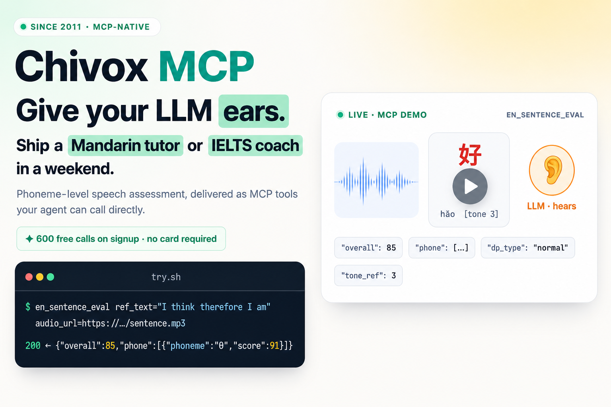
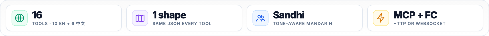
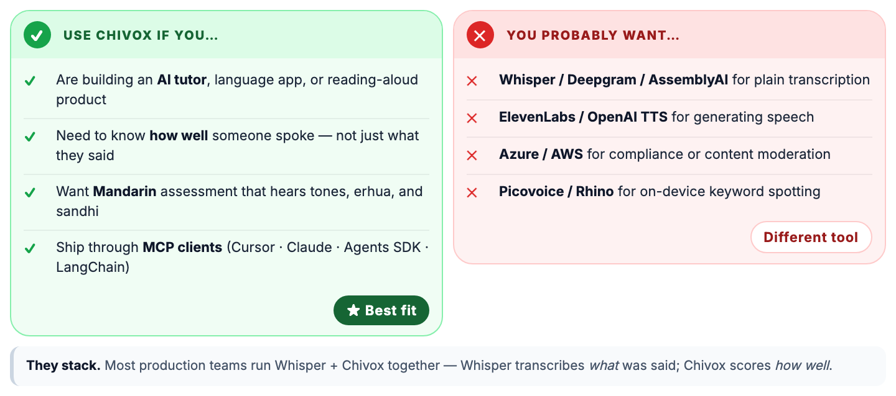
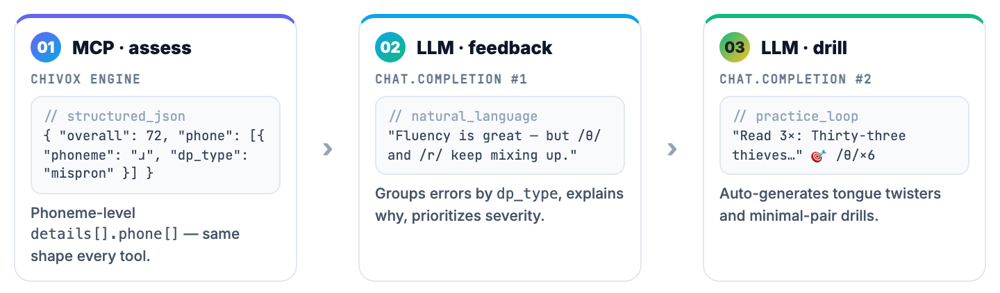
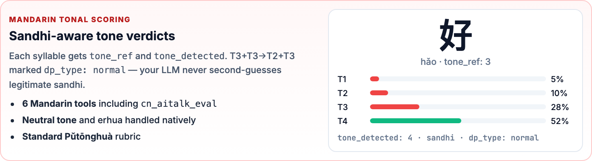
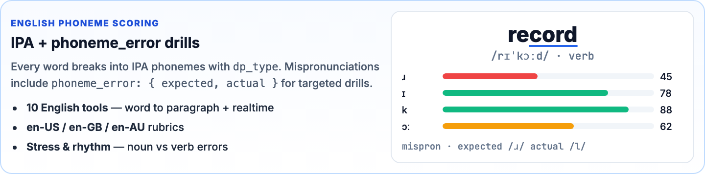
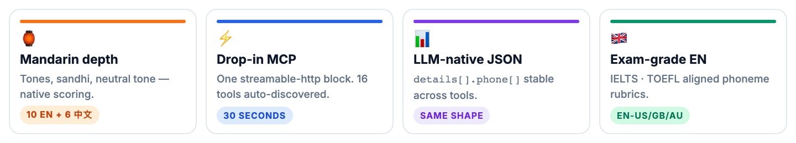
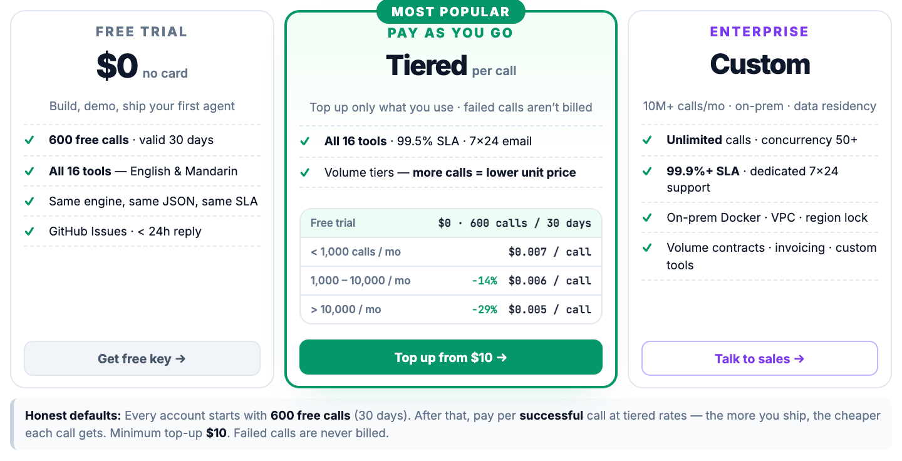
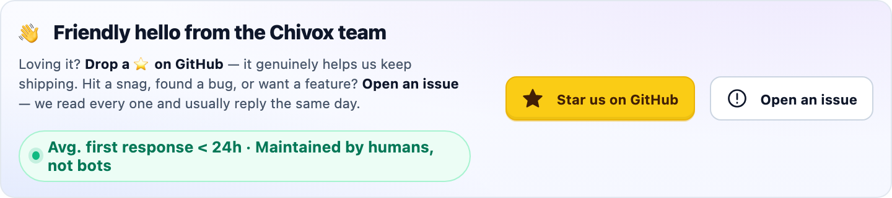

<a href="https://18ks.chivoxapp.com/doc/video20260424.mp4" title="▶ Play 15s product demo">
  
</a>

<div align="center">

<a href="https://api-portal.cloud.chivox.com/docs"></a>
&nbsp;
<a href="#-quickstart"></a>

<br/>


<br/>



</div>

**On this page:** [Fit check](#-is-this-for-you) · [Quickstart](#-quickstart) · [Compare](#️-how-it-compares) · [Response JSON](#-what-the-llm-actually-sees) · [Coach loop](#-the-three-stage-loop) · [Tools](#️-tools-catalog) · [Transport](#-dual-transport) · [Pricing](#-pricing) · [FAQ](#-faq)

---

> **TL;DR** — LLMs can't hear audio. **Chivox MCP** is a hosted MCP server that scores pronunciation at the phoneme level — Mandarin tones included. One `tools/call` returns `overall / accuracy / pron / fluency / details[].phone[]` in a stable JSON shape your model can reason over. Not STT. Not a Whisper wrapper.

> 📖 **Canonical reference:** [api-portal.cloud.chivox.com/docs](https://api-portal.cloud.chivox.com/docs) — endpoints, tool catalog, response fields, limits, and client configs.

> 🛠️ **Running this website repo locally?** See [`docs/deploy/README.md`](./docs/deploy/README.md) or paste [`docs/deploy/quickstart-prompt.md`](./docs/deploy/quickstart-prompt.md) into your agent.

---

## 🎯 Is this for you?

<p align="center">
  
</p>

> Most production teams run **Whisper + Chivox together**: Whisper to transcribe what was said, Chivox to score how well. They don't compete.

---

## 🚀 Quickstart

Hosted endpoint: **`https://mcp-global.cloud.chivox.com`** · every request needs `Authorization: Bearer <api_key>`. [Get a key →](https://api-portal.cloud.chivox.com)

<details open>
<summary><b>Cursor</b> &nbsp;<sub>(zero install)</sub></summary>

```json
// ~/.cursor/mcp.json
{
  "mcpServers": {
    "chivox-speech-eval": {
      "type": "streamable-http",
      "url": "https://mcp-global.cloud.chivox.com",
      "headers": { "Authorization": "Bearer <your_api_key>" }
    }
  }
}
```

</details>

<details>
<summary><b>🐍 LangChain</b></summary>

```python
from langchain_mcp_adapters.client import MultiServerMCPClient
from langgraph.prebuilt import create_react_agent

client = MultiServerMCPClient({
    "chivox": {
        "transport": "streamable_http",
        "url": "https://mcp-global.cloud.chivox.com",
        "headers": {"Authorization": "Bearer <your_api_key>"},
    }
})
tools = await client.get_tools()  # discovers all 16 tools

agent = create_react_agent("openai:gpt-4o-mini", tools)
result = await agent.ainvoke({"messages": [(
    "user",
    "Score https://example.com/audio/sentence.mp3, ref: I think therefore I am",
)]})
```

</details>

<details>
<summary><b>OpenAI Agents SDK</b></summary>

```python
from agents import Agent, Runner
from agents.mcp import MCPServerStreamableHttp

chivox = MCPServerStreamableHttp(
    params={
        "url": "https://mcp-global.cloud.chivox.com",
        "headers": {"Authorization": "Bearer <your_api_key>"},
    },
    name="chivox-speech-eval",
)

async with chivox:
    agent = Agent(
        name="coach",
        instructions="Professional speaking coach",
        mcp_servers=[chivox],
    )
    r = await Runner.run(
        agent,
        "Score https://example.com/audio/sentence.mp3, ref: I think therefore I am",
    )
    print(r.final_output)
```

</details>

<details>
<summary><b>Claude Desktop</b> &nbsp;<sub>(mic streaming via local proxy)</sub></summary>

```bash
npm install -g chivox-local-mcp
```

```json
// ~/Library/Application Support/Claude/claude_desktop_config.json
{
  "mcpServers": {
    "chivox": {
      "command": "chivox-local-mcp",
      "env": {
        "MCP_REMOTE_URL": "https://mcp-global.cloud.chivox.com",
        "MCP_API_KEY": "<your_api_key>"
      }
    }
  }
}
```

</details>

<details>
<summary><b>🐍 Raw MCP SDK</b></summary>

```python
import asyncio
from mcp.client.streamable_http import streamablehttp_client
from mcp import ClientSession

async def main():
    async with streamablehttp_client(
        "https://mcp-global.cloud.chivox.com",
        headers={"Authorization": "Bearer <your_api_key>"},
    ) as (r, w, _):
        async with ClientSession(r, w) as s:
            await s.initialize()
            out = await s.call_tool("en_sentence_eval", {
                "ref_text": "I think therefore I am",
                "audio_url": "https://example.com/audio/sentence.mp3",
            })
            print(out)

asyncio.run(main())
```

</details>

> More clients (Claude Code, Windsurf, Zed, Mastra, function-calling mode) → [docs → Clients](https://api-portal.cloud.chivox.com/docs)

---

## ⚖️ How it compares

> **Rule of thumb** — use **Whisper** to know *what* was said; use **Chivox** to know *how well*. They stack.

| | Whisper / Deepgram | ElevenLabs | Azure Pronunciation | **Chivox MCP** |
| --- | --- | --- | --- | --- |
| What it does | audio → text | text → audio | scores EN only | **scores EN + 中文** |
| Per-phoneme IPA scores | — | — | ✓ | **✓** |
| Mandarin tones + sandhi | — | — | basic | **✓ native** |
| `phoneme_error` for drills | — | — | — | **✓** |
| MCP-native · 16 tools | — | — | — | **✓** |

---

## 🧠 What the LLM actually sees

Every tool returns the **same top-level shape** — switch locale or granularity with zero schema work. Example for *"hello"*:

```json
{
  "overall": 85,
  "accuracy": 82,
  "pron": 88,
  "integrity": 95,
  "fluency": { "overall": 78, "speed": 65, "pause": 2 },
  "details": [
    {
      "char": "hello",
      "score": 85,
      "phone": [
        { "phoneme": "h",  "score": 90, "dp_type": "normal" },
        { "phoneme": "ɛ",  "score": 82, "dp_type": "normal" },
        { "phoneme": "l",  "score": 88, "dp_type": "normal" },
        { "phoneme": "oʊ", "score": 80, "dp_type": "normal" }
      ]
    }
  ]
}
```

On English mispronunciations, `phoneme_error: { expected, actual }` is included. Mandarin adds `tone_ref` / `tone_detected` with sandhi-aware `dp_type` verdicts. [Full field list →](https://api-portal.cloud.chivox.com/docs)

---

## 💬 …and here's what your LLM does with it

Pipe that JSON straight into any chat model with a one-line system prompt — *"You are a warm pronunciation coach. Diagnose, then drill."* — and you get a real lesson back. **No fine-tuning. No audio understanding. Just `chat.completion`.**

<table>
<tr>
<td width="50%" valign="top">

**🎤 Learner says**

> *"I want to record a record."*
> &nbsp;
> ⏱ 1.8 s · 🎚 SNR 22 dB

**📊 Chivox MCP returns**

```json
{
  "overall": 72,
  "details": [{
    "char": "record", "score": 58,
    "phone": [
      { "phoneme": "ɹ", "score": 45, "dp_type": "mispron",
        "phoneme_error": { "expected": "/ɹ/", "actual": "/l/" } }
    ]
  }]
}
```

</td>
<td width="50%" valign="top">

**🧠 GPT-4o / Claude / Qwen replies**

> 🎯 **Score 72** — nice rhythm, but *record* tripped you up.
>
> **What happened**
> - Your **`ɹ`** scored 45 — tongue touched the roof (sounds like an *L*). Keep it floating.
> - You said **`RE-cord`** (the noun). The verb wants stress on syllable 2: **`re-CORD`**.
>
> **🔁 30-second drill** — say each 3×:
> 1. *I want to re-CORD a RE-cord.*
> 2. *I rarely read raw research.* (`ɹ` loaded)
> 3. *Re-CORD, not RE-cord.* (stress flip)
>
> Want me to listen to your next take? 🎙

</td>
</tr>
</table>

> **Why this works** — the LLM never "heard" the audio. The JSON *names* the problem in fields it already understands (`dp_type: "mispron"`, `phoneme_error.actual`, `tone_ref` vs `tone_detected`), so a vanilla `chat.completion` can diagnose like a human teacher.

---

## 🔁 The three-stage loop

🎤 **Input:** 1-minute learner recording → **Output:** warm feedback + targeted drill, end-to-end in &lt; 1.6 seconds.

<p align="center">
  
</p>

<div align="center"><sub>Compatible with <b>GPT · Claude · Gemini · DeepSeek · Llama · Mistral · Qwen · GLM</b> — any model that speaks function calling.</sub></div>

---

## 🏮 The moat: a tireless Beijing-accent tutor

There are **30M+** foreigners and 2nd-gen diaspora learning Mandarin worldwide — and **zero** English-speaking platforms that can actually hear the difference between `mā / má / mǎ / mà`. Chivox's Chinese engine is trained on the same data powering China's Putonghua proficiency exam (普通话水平测试).

<p align="center">
  
</p>

---

## 🇬🇧 And yes — exam-grade English too

Same engine powering China's national Putonghua exam — aligned to **IELTS · TOEFL · K-12 gaokao · Cambridge YLE** for English. Same MCP endpoints, same 20+ fields. Just a different `ref_text` and `accent`.

<p align="center">
  
</p>

---

## 🛠️ Tools catalog

<details>
<summary><b>English (10 tools)</b></summary>

| Tool                      | Purpose                                      | Modes          |
| ------------------------- | -------------------------------------------- | -------------- |
| `en_word_eval`            | Single-word pronunciation                    | inline · stream |
| `en_word_correction`      | Omissions, extras, wrong phones              | inline          |
| `en_vocab_eval`           | Multiple words in one clip                   | inline          |
| `en_sentence_eval`        | Sentence accuracy + fluency                  | inline · stream |
| `en_sentence_correction`  | Per-word feedback                            | inline          |
| `en_paragraph_eval`       | Long-passage read-aloud                      | inline · stream |
| `en_phonics_eval`         | Letter-to-sound rules                        | inline          |
| `en_choice_eval`          | Oral multiple choice                         | inline          |
| `en_semi_open_eval`       | Scenario speaking                            | inline · stream |
| `en_realtime_eval`        | Realtime read-aloud                          | stream          |

</details>

<details>
<summary><b>Mandarin Chinese (6 tools)</b></summary>

| Tool                   | Purpose                        | Modes          |
| ---------------------- | ------------------------------ | -------------- |
| `cn_word_raw_eval`     | Hanzi pronunciation            | inline · stream |
| `cn_word_pinyin_eval`  | Pinyin + tone scoring          | inline          |
| `cn_sentence_eval`     | Short utterances               | inline · stream |
| `cn_paragraph_eval`    | Long text                      | inline          |
| `cn_rec_eval`          | Constrained recognition        | inline          |
| `cn_aitalk_eval`       | Open-ended dialog evaluation   | stream          |

</details>

**Inline audio:** pass `audio_url` or `audio_base64` in the tool call — no upload round-trip. **Formats:** mp3 · wav · ogg · m4a · aac · pcm. [Per-tool notes →](https://api-portal.cloud.chivox.com/docs)

---

## 🔌 Dual transport

Two ways to feed audio — **same result shape**, different UX. Function-calling fallback: `fc-global.cloud.chivox.com`.

| | **Streaming mic** | **Inline audio** |
| --- | --- | --- |
| Best for | Live tutoring — audio flows while the user speaks | Batch jobs — finished clip in one tool call |
| MCP path | `/ws/audio/{session_id}` | `POST /` Streamable HTTP · `tools/call` |
| Input | WebSocket audio stream | `audio_url` or `audio_base64` |
| Session | 60 s idle timeout · `resume_token` | Stateless per call |

---

## 💎 Why developers ship with Chivox MCP

<p align="center">
  
</p>

Plus: **streaming + inline** modes · **TLS 1.3** on every hop · audio processed and dropped (JSON retained 30 days) · on-prem available for enterprise · [limits & privacy →](https://api-portal.cloud.chivox.com/docs)

---

## 💳 Pricing

Honest defaults. Start with **600 free calls** (30 days) and **all 16 tools unlocked** — no feature gates, no card. When you need more, pay per successful call at **tiered rates** — the more you ship, the cheaper each call gets.

<p align="center">
  
</p>

> **Free tier ≠ crippled tier.** Every new account gets **600 free calls valid for 30 days** with the **full 16-tool catalog** — same engine, same JSON, same SLA as paid keys. After the trial window or when calls are used up, top up from **$10** and let the **volume tiers** do the rest. Failed calls are never billed.

---

## ❓ FAQ

<details>
<summary>Is this just another wrapper around Whisper?</summary>

No. Whisper transcribes; Chivox scores. The engine is trained on exam-graded samples and returns phoneme-level `details[].phone[]` — not a transcript. Most teams run both.

</details>

<details>
<summary>Does it work offline / on-device?</summary>

The hosted MCP server needs outbound access to the scoring engine. For air-gapped deployments, contact us — we ship an on-prem container for enterprise customers.

</details>

<details>
<summary>What about dialects and accents?</summary>

Mandarin targets standard Pǔtōnghuà with sandhi-aware tone verdicts. English supports en-US, en-GB, and en-AU rubrics via locale parameters on the relevant tools.

</details>

<details>
<summary>Which LLMs work out of the box?</summary>

Any model with OpenAI-style function calling: GPT-4o / 5.x, Claude Sonnet / Opus, Gemini, DeepSeek, GLM, Kimi, Doubao, Qwen. Tool schemas are forwarded verbatim.

</details>

<details>
<summary>Can I use this in a browser?</summary>

For quick demos, yes — but production traffic should flow through your backend so the API key stays server-side. [Privacy notes →](https://api-portal.cloud.chivox.com/docs)

</details>

---

## 🤝 Star us · say hi

<p align="center">
  <a href="https://github.com/boyzhong123/mcp22">
    
  </a>
</p>
