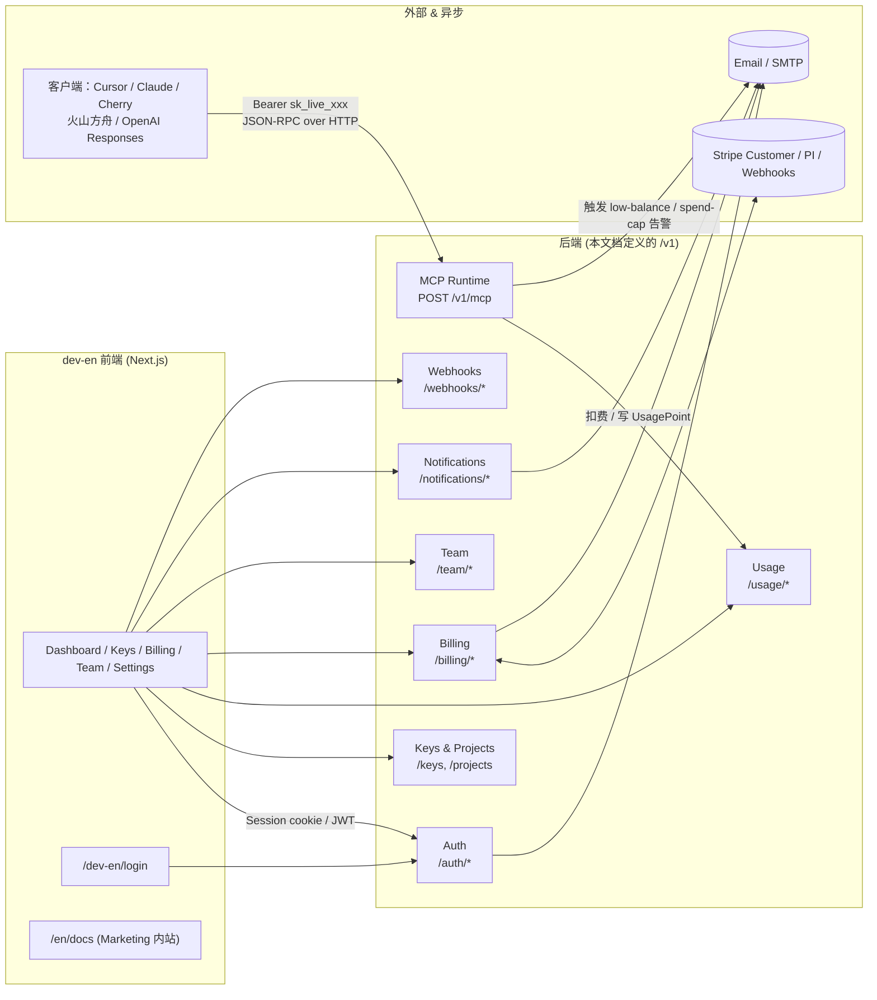
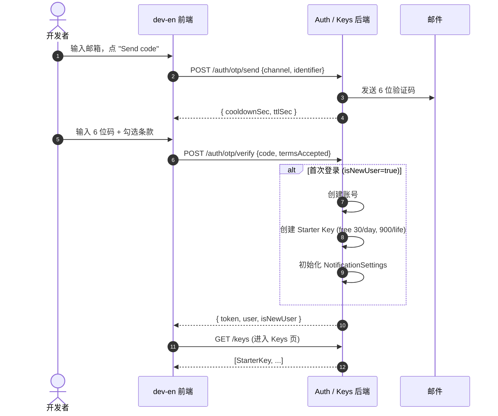
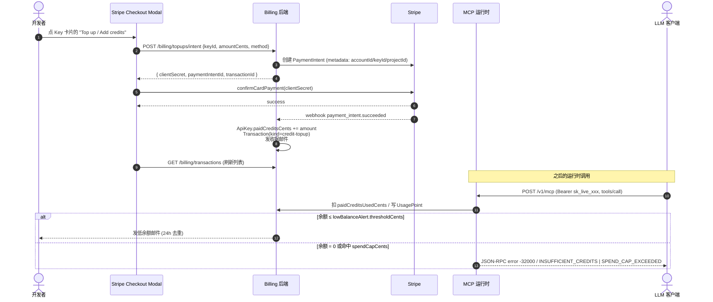
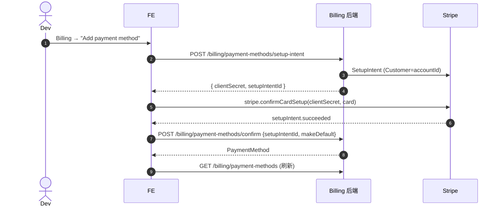
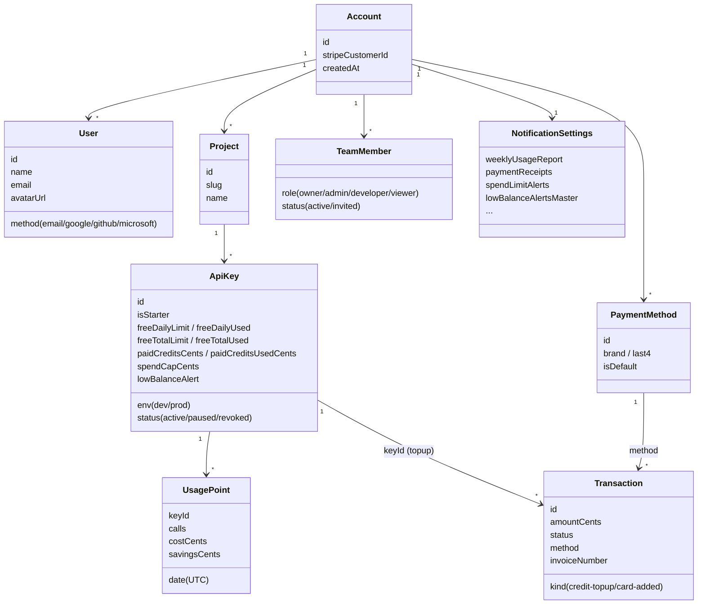
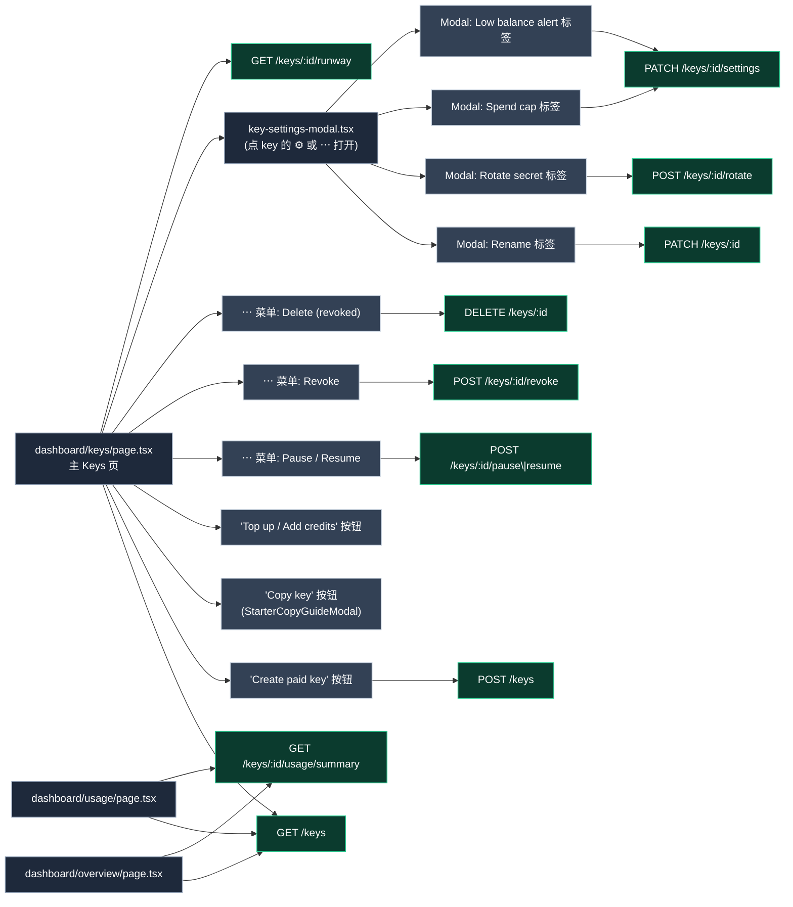

# Chivox MCP 英文开发者控制台 —— 后端接口文档

> 适用范围：`src/app/dev-en` 下的英文 2C 开发者控制台（登录、Dashboard、计费、团队、通知等全部功能）。
> 所有字段、状态、单位均严格对应当前前端 Mock Store：`src/app/dev-en/_lib/mock-store.ts` 与 `src/app/dev-en/_lib/mock-auth.tsx`。
> 本文可直接作为前后端对接契约 v0。
>
> 下列 Mermaid 图在 GitHub、Cursor 内置 Markdown Preview、VSCode Markdown Preview Mermaid Support 扩展中均能直接渲染。如需导出静态图，推荐用 [mermaid.live](https://mermaid.live) 粘贴源码导出 SVG/PNG。
>
> **UI 截图**：每个模块的速查表下方都预埋了 `` 引用，指向 `docs/images/dev-en/*.png`。截图命名与抓取重点见 [`docs/images/dev-en/README.md`](./images/dev-en/README.md)；图一落盘就会自动在文档里渲染，没有图的位置会显示 broken image + alt 文字，不会影响文档结构。

---

## 导读：先看这三张图

### 图 1 —— 系统拓扑

控制台（本前端）只说 "控制面" 接口；MCP 实际调用走独立的 "运行时" endpoint。Stripe 与邮件服务在后端内部完成，前端不直连。



### 图 2 —— 前端模块 ↔ 后端接口映射（按左侧导航顺序）

这是 "读完立刻知道该修哪个接口" 的那张图。每个前端文件下面列出它会命中的所有 endpoint（星号 `*` 表示该页是主要调用方，其它页面只是顺带读）。

```mermaid
flowchart LR
  classDef page fill:#1e293b,stroke:#94a3b8,color:#ffffff,stroke-width:1.2px;
  classDef api fill:#0b3b2e,stroke:#34d399,color:#ffffff,stroke-width:1.2px;
  classDef note fill:#422006,stroke:#fbbf24,color:#fef3c7,stroke-width:1.2px;

  L["login/page.tsx<br/>oauth-buttons.tsx"]:::page
  OV["dashboard/overview"]:::page
  KS["dashboard/keys/page.tsx<br/>+ key-settings-modal"]:::page
  US["dashboard/usage"]:::page
  BL["dashboard/billing/*"]:::page
  RH["dashboard/recharge-history"]:::page
  TM["dashboard/team"]:::page
  ST["dashboard/settings<br/>(profile, members, notif)"]:::page
  STR["stripe-checkout-modal.tsx<br/>(从 Keys / Billing 唤起)"]:::page

  A1["POST /auth/otp/send"]:::api
  A2["POST /auth/otp/verify"]:::api
  A3["GET  /auth/oauth/:provider/*"]:::api
  A4["GET  /auth/me"]:::api
  A5["PATCH /auth/me"]:::api
  A6["POST /auth/logout"]:::api

  P1["GET /projects"]:::api
  P2["POST /projects"]:::api

  K1["GET /keys"]:::api
  K2["POST /keys"]:::api
  K3["PATCH /keys/:id"]:::api
  K4["POST /keys/:id/rotate"]:::api
  K5["POST /keys/:id/pause|resume"]:::api
  K6["POST /keys/:id/revoke"]:::api
  K7["DELETE /keys/:id"]:::api
  K8["PATCH /keys/:id/settings"]:::api
  K9["GET /keys/:id/usage/summary"]:::api
  K10["GET /keys/:id/runway"]:::api

  U1["GET /usage/points"]:::api
  U2["GET /usage/account-summary"]:::api
  U3["GET /usage/export.csv"]:::api

  B1["GET /billing/pricing"]:::api
  B2["GET|PUT /billing/spend-limit"]:::api
  B3["GET /billing/payment-methods"]:::api
  B4["POST /billing/payment-methods/setup-intent"]:::api
  B5["POST /billing/payment-methods/confirm"]:::api
  B6["POST /billing/payment-methods/:id/default"]:::api
  B7["DELETE /billing/payment-methods/:id"]:::api
  B8["POST /billing/topups/intent"]:::api
  B9["POST /billing/topups/:id/confirm"]:::api
  B10["GET /billing/transactions"]:::api
  B11["GET /billing/invoices/:n.pdf"]:::api

  T1["GET /team/members"]:::api
  T2["POST /team/members/invite"]:::api
  T3["POST /team/members/:id/resend"]:::api
  T4["PATCH /team/members/:id"]:::api
  T5["DELETE /team/members/:id"]:::api

  N1["GET|PATCH /notifications/settings"]:::api
  H1["GET|POST|DELETE /webhooks/endpoints*"]:::api

  L --> A1 & A2 & A3
  OV --> A4 & U2 & K1 & U1 & B2 & B10
  KS --> K1 & K2 & K3 & K4 & K5 & K6 & K7 & K8 & K9 & K10 & P1 & P2
  US --> U1 & U2 & U3 & K1
  BL --> B1 & B2 & B3 & B4 & B5 & B6 & B7 & B10 & B11 & U2
  RH --> B10 & B11
  TM --> T1 & T2 & T3 & T4 & T5
  ST --> A4 & A5 & A6 & N1 & T1 & H1
  STR --> B3 & B4 & B5 & B8 & B9
```



### 图 3 —— 三条最关键的业务流程时序

#### 3a. 首次登录（OTP）→ 自动发 Starter Key



#### 3b. 给某个 Key 充值 → MCP 扣费 → 告警

实线是同步调用，虚线是 Stripe webhook 触发的异步流。



#### 3c. 绑卡（SetupIntent）



### 图 4 —— 关键数据结构之间的引用关系

看字段/外键时用这张；详细字段在 §3 / §5 / §6 里。



---

## 0. 通用约定

- **BaseURL**：建议 `https://api.chivoxmcp.com/v1`
- **鉴权**：
  - 控制台接口：会话 Token（`Cookie: session=...` 或 `Authorization: Bearer <jwt>`）
  - MCP 运行时接口：`Authorization: Bearer sk_live_xxx / sk_test_xxx`
- **内容类型**：`application/json; charset=utf-8`
- **时间**：所有 `*At` 字段使用 ISO 8601（UTC）；`date` 字段格式 `YYYY-MM-DD`（UTC）
- **金额**：一律使用 **cents**（整数），前端再格式化为 USD
- **分页**：列表接口统一 `?page=1&pageSize=20`，返回 `{ items, total, page, pageSize }`
- **错误结构**：
  ```json
  { "error": { "code": "INVALID_REQUEST", "message": "…", "field": "email" } }
  ```
- **幂等**：涉及金钱/建资源的 POST 接受 `Idempotency-Key` 头

---

## 1. Auth（登录 / 会话）

登录方式四种：`email`（一次性验证码）、`google`、`github`、`microsoft`。
手机号 / 短信 OTP 已从 B2C 流程中移除（欧美开发者对手机号较敏感；企业场景改走 Microsoft Entra）。

### 前端调用方速查

| § | Endpoint | 前端文件 | UI 触发点 |
| --- | --- | --- | --- |
| 1.1 | `POST /auth/otp/send` | `login/page.tsx` | "Send code / 发送验证码" 按钮 |
| 1.2 | `POST /auth/otp/verify` | `login/page.tsx` | "Continue / 继续" 提交按钮 |
| 1.3 | `GET /auth/oauth/{provider}/start\|callback` | `_components/oauth-buttons.tsx` | GitHub / Google / Microsoft 三个按钮 |
| 1.4 | `GET /auth/me` | `_lib/mock-auth.tsx`（全局 hydrate） | 应用首次加载、刷新、登录回跳 |
| 1.5 | `PATCH /auth/me` | `dashboard/profile/page.tsx` | "Save changes / 保存修改"（name / email / avatar） |
| 1.6 | `POST /auth/logout` | `_components/sidebar.tsx` → `UserChip` | 侧栏头像 → "Sign out / 登出" |

<p></p>

### 1.1 发送一次性验证码

`POST /auth/otp/send`

```json
// req
{ "channel": "email", "identifier": "you@x.com" }
// resp
{ "cooldownSec": 30, "ttlSec": 300 }
```

- 30 秒内重发需返回 429，并带 `retryAfterSec`
- 需要接人机验证（前端 `AntiBot` 组件），建议接入 reCAPTCHA / hCaptcha，头 `X-Captcha-Token`
- 目前 `channel` 只有 `email`；`phone` 预留字段位但不在对外契约里启用

### 1.2 校验验证码并登录

`POST /auth/otp/verify`

```json
// req
{ "channel": "email", "identifier": "...", "code": "123456", "termsAccepted": true }
// resp
{ "token": "...", "user": MockUser, "isNewUser": true }
```

首次登录成功时后端需要：创建账号 → **自动下发一把 Starter Key**（见 §3）→ 初始化 Notification 默认值。

### 1.3 OAuth 登录

`GET /auth/oauth/{provider}/start?redirect=...`  →  `GET /auth/oauth/{provider}/callback`

- provider: `google` | `github` | `microsoft`
- 回调成功返回同 1.2 的结构
- Microsoft 使用 Entra ID (v2) common endpoint，覆盖个人 Outlook / 企业工作账号

### 1.4 当前用户

`GET /auth/me`

```ts
MockUser {
  id: string
  name: string
  email: string
  avatarUrl?: string
  method: 'email' | 'google' | 'github' | 'microsoft'
  createdAt: string
}
```

### 1.5 修改资料

`PATCH /auth/me`

```json
{ "name"?: "...", "email"?: "...", "avatarUrl"?: "..." }
```

仅允许上述三个字段。邮箱变更需要二次验证（可返回 `requiresVerification: true`）。

### 1.6 登出

`POST /auth/logout`

---

## 2. Projects（项目）

项目是 API Key 的命名空间（一个项目下多把 key）。当前 UI 里几乎所有提到项目名的地方都需要这两个接口。

### 前端调用方速查

| § | Endpoint | 前端文件 | UI 触发点 |
| --- | --- | --- | --- |
| 2.1 | `GET /projects` | `dashboard/keys/page.tsx`、`dashboard/usage/page.tsx`、`stripe-checkout-modal.tsx` | Keys 页项目分组、Usage 页项目过滤器、充值弹窗的项目选择器 |
| 2.2 | `POST /projects` | `dashboard/keys/page.tsx`（`CreateProjectModal`）、`stripe-checkout-modal.tsx` | Keys 页 "New project / 新建项目"、充值弹窗里 "Create new project" 快捷项 |

### 2.1 列表

`GET /projects` → `Project[]`

```ts
Project { id: string; slug: string; name: string; createdAt: string }
```

### 2.2 创建

`POST /projects`  body `{ "name": "Production API" }` → `Project`

- 后端生成 `slug`（如 `mcp-project-1234567890`）

> 当前 UI 暂未提供改名/删除，可先预留 `PATCH /projects/:id`、`DELETE /projects/:id`。

---

## 3. API Keys（核心）

> 账号模型两档：**Starter Key**（每账号唯一，免费额度 30/day、900/life，**可充值解除每日封顶**）+ **Paid Keys**（需充值，可设月度上限与低余额告警）。

### 前端调用方速查

这节是全文最多接口的一块，建议配合下面 "图 3.0 页面-按钮-接口流程" 一起看：左边是页面上的按钮，右边是它会命中的 endpoint。



速查表（和上图一一对应）：

| § | Endpoint | 前端文件 | UI 触发点 |
| --- | --- | --- | --- |
| 3.2 | `GET /keys` | `dashboard/keys/page.tsx` | 首次进入 Keys 页；Overview / Usage 页也顺带拉一份做展示 |
| 3.3 | `POST /keys` | `dashboard/keys/page.tsx` | "Create paid key / 创建付费 Key" 绿色按钮（走 `NewKeyRevealModal` 一次性展示明文 secret） |
| 3.4 | `PATCH /keys/:id` | `_components/key-settings-modal.tsx` | 齿轮弹窗 → Rename 标签页 → "Save" |
| 3.5 | `POST /keys/:id/rotate` | `_components/key-settings-modal.tsx` | 齿轮弹窗 → Rotate 标签页 → "Rotate secret"（成功后再次弹 `NewKeyRevealModal`） |
| 3.6 | `POST /keys/:id/pause` / `.../resume` | `dashboard/keys/page.tsx` | key 卡片右上 ⋯ 菜单 → "Pause" / "Resume" |
| 3.7 | `POST /keys/:id/revoke` | `dashboard/keys/page.tsx` | ⋯ 菜单 → "Revoke"（确认对话框） |
| 3.8 | `DELETE /keys/:id` | `dashboard/keys/page.tsx` | Revoked 分组下每条的 "Delete permanently"（仅 revoked 可见） |
| 3.9 | `PATCH /keys/:id/settings` | `_components/key-settings-modal.tsx` | 齿轮弹窗 → Spend cap / Low-balance alert 两个标签页 |
| 3.10 | `GET /keys/:id/usage/summary` | `dashboard/keys/page.tsx` 的 `PaidKeyCard`、`dashboard/overview/page.tsx`（最活跃付费 key 区块）、`dashboard/usage/page.tsx` | 每个 paid key 卡片的 "Lifetime calls" 数字 |
| 3.11 | `GET /keys/:id/runway?additionalCents=0` | `dashboard/keys/page.tsx`（`CreditRunway` 子组件）、`stripe-checkout-modal.tsx` | paid key 卡片的 "≈ X days runway" 文案；充值弹窗的 "after top-up: ≈ Y days" 预览 |

> 关于 Starter 充值：在前端里 "Top up / Add credits" 按钮对 Starter 和 Paid 是同一个入口（`stripe-checkout-modal.tsx` 的 `mode='add-credits'`），最终都落到 §5.4 `POST /billing/topups/intent` —— 本节接口里没有 "给 key 充值" 这一个 endpoint，别找。

<p></p>
<p></p>
<p></p>

### 3.1 ApiKey 数据结构

```ts
ApiKey {
  id: string
  name: string
  env: 'development' | 'production'
  projectId: string
  secret: string             // 完整明文，仅创建/轮换后响应一次
  maskedSecret: string       // sk_live_xxxx••••••••••••••••abcd
  createdAt: string
  lastUsedAt: string | null
  status: 'active' | 'paused' | 'revoked'
  isStarter: boolean
  // 免费额度（仅 starter 非 0）
  freeDailyLimit: number
  freeDailyUsed: number
  freeDailyResetAt: string   // UTC 日期翻转时重置
  freeTotalLimit: number
  freeTotalUsed: number
  // 付费额度（per-key，仅 paid 有效），单位 cents
  paidCreditsCents: number
  paidCreditsUsedCents: number
  spendCapCents: number | null   // 月度封顶，null=不封顶
  lowBalanceAlert: { enabled: boolean; thresholdCents: number } | null
}
```

### 3.2 列表

`GET /keys?projectId=&env=&status=` → `ApiKey[]`

- 列表中 `secret` 必须不返回或只返回 `maskedSecret`

### 3.3 创建 Paid Key

`POST /keys`

```json
{ "name": "Web App — Prod", "env": "production", "projectId": "proj_xxx" }
```

返回 `ApiKey` 且带完整 `secret`（前端弹窗一次性显示）。新建 Paid Key 默认 `paidCreditsCents=0`，`status='active'` 但不可服务流量，需要先充值。

### 3.4 重命名

`PATCH /keys/:id` body `{ "name": "..." }`

### 3.5 轮换 secret

`POST /keys/:id/rotate` → 新 `ApiKey`（含新 `secret`）

- Starter Key 也允许轮换（id 不变）

### 3.6 暂停 / 恢复

`POST /keys/:id/pause` / `POST /keys/:id/resume`

- 禁止操作 Starter 和已 revoked 的 key

### 3.7 撤销（软删除）

`POST /keys/:id/revoke` → `204`

- 禁止 Starter

### 3.8 彻底删除（清理 revoked）

`DELETE /keys/:id` → `204`

- 禁止 Starter

### 3.9 更新 Key 级设置（月度上限 / 低余额告警）

`PATCH /keys/:id/settings`

```json
{
  "spendCapCents": 25000 | null,
  "lowBalanceAlert": { "enabled": true, "thresholdCents": 500 } | null
}
```

- Starter 返回 409 / 忽略

### 3.10 Key 级用量汇总

`GET /keys/:id/usage/summary?window=28d`

```json
{
  "calls": 32100,
  "costCents": 3210,
  "savingsCents": 412,
  "avgDailyNetCents": 115,
  "daysWithUsage": 22
}
```

用于前端 `getKeyUsageSummary` / `estimateKeyCreditRunway`。

### 3.11 Key 级 runway（可由前端用 3.10 自算，也可后端直接算）

`GET /keys/:id/runway?additionalCents=0`

```ts
{
  windowDays: 28,
  avgDailyNetCents: number,
  balanceAfterCents: number,
  estimatedDays: number | null,
  estimatedCallsAtPace: number | null,
  confidence: 'high' | 'low' | 'none'
}
```

---

## 4. Usage（用量 & 图表）

### 前端调用方速查

| § | Endpoint | 前端文件 | UI 触发点 |
| --- | --- | --- | --- |
| 4.1 | `GET /usage/points` | `dashboard/usage/page.tsx`（主页）、`dashboard/billing/page.tsx`（Savings 折线图）、`dashboard/overview/page.tsx`（顶部 KPI 副标的小图） | Usage 页的日/月视图切换、日期范围选择器、project / key 过滤器 |
| 4.2 | `GET /usage/account-summary` | `dashboard/overview/page.tsx` | 顶部 4 个 KPI 卡（Calls / Spend / Savings / Spend cap used） |
| 4.3 | `GET /usage/export.csv` | `dashboard/usage/page.tsx` | 页面右上角 "Export CSV / 导出 CSV" 按钮 |

<p></p>
<p></p>

### 4.1 明细点（柱/面积图数据）

`GET /usage/points?from=2026-01-01&to=2026-04-23&projectId=&keyId=&granularity=day`

```ts
UsagePoint {
  date: 'YYYY-MM-DD',       // UTC
  keyId: string,
  model: 'mcp-call',        // 目前只有一种，预留多模型
  calls: number,
  costCents: number,        // 净额（已减 savings）
  savingsCents: number
}
```

建议支持窗口 `7 | 14 | 28 | 90` 天，最长 180 天。

### 4.2 账号月度汇总（Overview KPI）

`GET /usage/account-summary?month=2026-04`

```json
{
  "callsThisMonth": 108452,
  "spendCentsThisMonth": 9871,
  "savingsCentsThisMonth": 1320,
  "currentVolumeTier": { "upTo": 1000000, "discount": 0.15, "label": "100K – 1M calls" }
}
```

### 4.3 CSV 导出

`GET /usage/export.csv?from=&to=&keyId=&projectId=` → `text/csv`

- 列：`date,keyId,keyName,project,model,calls,costCents,savingsCents`

---

## 5. Billing（充值 / 额度 / 发票）

### 前端调用方速查

Billing 的接口既在 Billing 页自己用，也被 **充值弹窗 `stripe-checkout-modal.tsx`** 大量复用（弹窗被 Overview / Keys / Billing 三个地方唤起）。

| § | Endpoint | 前端文件 | UI 触发点 |
| --- | --- | --- | --- |
| 5.1 | `GET /billing/pricing` | `dashboard/billing/rates/page.tsx`、`stripe-checkout-modal.tsx` | Rates 页的阶梯价表格；充值弹窗的 "Next tier at N calls" 提示 |
| 5.2 | `GET /billing/spend-limit` | `dashboard/billing/page.tsx`、`dashboard/overview/page.tsx` | Billing "Monthly spend cap" 小卡；Overview "Spend limit used" KPI |
| 5.2 | `PUT /billing/spend-limit` | `dashboard/billing/page.tsx`（`SpendLimitEditor`） | 深链 `?edit=spend-limit#spend-limit` 自动进入编辑；"Save" 按钮提交 |
| 5.3 | `GET /billing/payment-methods` | `dashboard/billing/page.tsx`、`stripe-checkout-modal.tsx` | Billing "Payment methods" 区域；充值弹窗卡片选择器 |
| 5.3 | `POST /billing/payment-methods/setup-intent` + `/confirm` | `dashboard/billing/page.tsx`、`stripe-checkout-modal.tsx` | "Add payment method / 添加支付方式" 按钮；充值弹窗里 "Use a new card" 分支 |
| 5.3 | `POST /billing/payment-methods/:id/default` | `dashboard/billing/page.tsx` | 每张卡右侧 "Set as default" 按钮 |
| 5.3 | `DELETE /billing/payment-methods/:id` | `dashboard/billing/page.tsx` | 每张卡右侧 ⋯ → "Remove" |
| 5.4 | `POST /billing/topups/intent` | `_components/stripe-checkout-modal.tsx` | **所有 "Top up / Add credits / 充值" 按钮最终都落在这里**：Overview 告警条、Overview Paid key 列表、Starter 卡片、Paid key 卡片、Billing 页 Quick actions |
| 5.4 | `POST /billing/topups/:transactionId/confirm` | `_components/stripe-checkout-modal.tsx` | Stripe `confirmCardPayment` 成功后前端回调（也允许后端靠 webhook 自动完成） |
| 5.5 | `GET /billing/transactions` | `dashboard/recharge-history/page.tsx`、`dashboard/overview/page.tsx` | Recharge history 主列表；Overview "Recent activity" 右侧栏 |
| 5.6 | `GET /billing/invoices/:n.pdf` | `dashboard/recharge-history/page.tsx` | 每行右侧的 "Download PDF" 图标按钮 |

<p></p>
<p></p>
<p></p>

### 5.1 定价

`GET /billing/pricing`

```json
{
  "mcpCallRatePerK": 1.0,
  "volumeTiers": [
    { "upTo": 100000, "discount": 0, "label": "0 – 100K calls" },
    { "upTo": 1000000, "discount": 0.15, "label": "100K – 1M calls" },
    { "upTo": 10000000, "discount": 0.30, "label": "1M – 10M calls" },
    { "upTo": null, "discount": null, "label": "10M+ calls" }
  ]
}
```

### 5.2 账户月度消费上限（Spend Limit）

- `GET /billing/spend-limit` →
  ```ts
  { monthlyCapCents: number; resetDay: number; warnAtPercents: number[] }
  ```
- `PUT /billing/spend-limit`
  ```json
  { "monthlyCapCents": 20000, "warnAtPercents": [50, 75, 90] }
  ```

### 5.3 支付方式（Stripe 托管）

```ts
PaymentMethod {
  id, brand: 'visa'|'mastercard'|'amex',
  last4: string, expMonth: number, expYear: number,
  name: string, isDefault: boolean, createdAt: string
}
```

- `GET /billing/payment-methods` → `PaymentMethod[]`
- `POST /billing/payment-methods/setup-intent` → `{ clientSecret, setupIntentId }`（用于前端 Stripe Element 绑卡）
- `POST /billing/payment-methods/confirm`
  ```json
  { "setupIntentId": "seti_...", "makeDefault": true }
  ```
  → `PaymentMethod`
- `POST /billing/payment-methods/:id/default`
- `DELETE /billing/payment-methods/:id` —— 若删除的是默认卡，后端自动把第一张剩余卡置为默认

### 5.4 充值到某个 Key（Credit Top-up）

前端 `stripe-checkout-modal.tsx` 支持：saved 卡 / new-card / Apple / Google / Link / Cash App / PayPal / Amazon Pay / ACH / Wire。

- 创建 PaymentIntent
  `POST /billing/topups/intent`
  ```json
  {
    "keyId": "key_xxx",
    "amountCents": 5000,
    "method": "card" | "apple-pay" | "google-pay" | "link" | "cashapp" | "paypal" | "amazon-pay" | "ach" | "wire",
    "paymentMethodId": "pm_xxx" | null,
    "country": "US",
    "savePaymentMethod": true
  }
  ```
  → `{ clientSecret, paymentIntentId, transactionId }`

- 回调/确认
  `POST /billing/topups/:transactionId/confirm` → `Transaction`
  （更常见做法：后端监听 Stripe webhook，自动把到账金额加到 `paidCreditsCents` 并产出 Transaction；前端做 long-poll 或 SSE 等待。）

- **关键后端行为**：top-up 成功后必须原子地：
  1. 创建 `Transaction`（kind=`credit-topup`，关联 keyId / projectId）
  2. `ApiKey.paidCreditsCents += amountCents`
  3. 触发一条发票邮件（若 `NotificationSettings.paymentReceipts`）

### 5.5 交易 / 充值历史

`GET /billing/transactions?from=&to=&kind=&keyId=&page=&pageSize=`

```ts
Transaction {
  id, createdAt, amountCents,
  status: 'succeeded'|'pending'|'failed',
  method: 'card'|'apple-pay'|'google-pay'|'link'|'cashapp'|'paypal'|'amazon-pay'|'ach'|'wire',
  last4: string,
  description: string,
  invoiceNumber: string,       // 'INV-xxxxx'
  kind: 'credit-topup' | 'card-added',
  keyId?: string,
  projectId?: string
}
```

### 5.6 发票下载

`GET /billing/invoices/:invoiceNumber.pdf` → `application/pdf`

---

## 6. Team（团队成员）

### 前端调用方速查

所有 Team 接口只有 `dashboard/team/page.tsx` 这一个调用方（Settings → Members 区是同一个页面的锚点链接）。

| Endpoint | UI 触发点 |
| --- | --- |
| `GET /team/members` | 进入 Team 页 |
| `POST /team/members/invite` | "Invite member / 邀请成员" 对话框的 "Send invite" |
| `POST /team/members/:id/resend` | 每行 `invited` 状态的 "Resend" 链接 |
| `PATCH /team/members/:id` | 每行 Role 下拉（owner 行禁用） |
| `DELETE /team/members/:id` | 每行 ⋯ → "Remove"（owner 行禁用） |

<p></p>

```ts
TeamMember {
  id, name, email,
  role: 'owner'|'admin'|'developer'|'viewer',
  status: 'active'|'invited',
  createdAt, lastActiveAt: string|null,
  avatarSeed: number
}
```

- `GET /team/members` → `TeamMember[]`
- `POST /team/members/invite`
  ```json
  { "email": "...", "role": "developer", "name": "optional" }
  ```
  幂等：同 email 已存在则返回已有成员。后端发送邀请邮件，状态 `invited`。
- `POST /team/members/:id/resend` → 重发邀请邮件
- `PATCH /team/members/:id` body `{ "role": "admin" }`（`owner` 不可被改）
- `DELETE /team/members/:id`（`owner` 不可删除）

权限建议：`owner/admin` 可管 members & billing；`developer` 可管 keys；`viewer` 只读。

---

## 7. Notifications（通知偏好）

### 前端调用方速查

| Endpoint | 前端文件 | UI 触发点 |
| --- | --- | --- |
| `GET /notifications/settings` | `dashboard/settings/page.tsx` | 进入 Settings 页 → "Notifications" 区域 |
| `PATCH /notifications/settings` | `dashboard/settings/page.tsx` | 每个开关切换时（前端通常 debounce 后提交） |

<p></p>

```ts
NotificationSettings {
  weeklyUsageReport: boolean
  paymentReceipts: boolean
  invoiceReady: boolean
  spendLimitAlerts: boolean
  lowBalanceAlertsMaster: boolean   // 总开关；per-key 阈值仍看 ApiKey.lowBalanceAlert
  productUpdates: boolean
  securityAlerts: boolean           // 建议强制 true
}
```

- `GET /notifications/settings` → `NotificationSettings`
- `PATCH /notifications/settings` body：以上字段的部分子集

---

## 8. MCP 运行时接口（发放 key 的实际调用入口）

Chivox MCP 对外只暴露**单一** Streamable HTTP endpoint，严格遵循 MCP 规范（2025-03-26 及以后），以便被 Claude / Cursor / 火山方舟（豆包）/ OpenAI Responses API 等 Remote MCP 客户端直接挂载。

- `POST /v1/mcp` —— JSON-RPC 2.0 over Streamable HTTP
  - 响应 `Content-Type`：`application/json` 或 `text/event-stream`（由客户端 Accept 决定）
  - 支持方法：`initialize`、`tools/list`、`tools/call`、`ping`、`notifications/*`
  - 鉴权：`Authorization: Bearer sk_live_xxx`（推荐）或 `X-Api-Key: sk_live_xxx`
  - **必须无状态**（stateless streamable HTTP）：不依赖 `Mcp-Session-Id` 常驻会话，每个请求独立鉴权
  - 不提供 WebSocket；老版 `sse` transport 不再支持

> stdio 模式仅用于本地客户端（Claude Desktop / Cursor / Cherry Studio 等）通过 CLI/SDK 自启子进程的场景，不对外暴露为服务。

### 8.1 接入火山方舟 / 豆包（Responses API）

按 [火山方舟 云部署 MCP / Remote MCP](https://www.volcengine.com/docs/82379/1827534) 规范，用户在方舟侧把我们当作一个 MCP tool 挂载：

```json
POST https://ark.cn-beijing.volces.com/api/v3/responses
Authorization: Bearer <ARK_API_KEY>
Content-Type: application/json

{
  "model": "doubao-seed-...",
  "input": [{ "role": "user", "content": "..." }],
  "tools": [{
    "type": "mcp",
    "mcp_server_label": "chivox",
    "mcp_server_url": "https://api.chivoxmcp.com/v1/mcp",
    "headers": { "Authorization": "Bearer sk_live_xxx" }
  }]
}
```

- 外层 `Authorization` 是用户的 **ARK_API_KEY**，与我们无关。
- `tools[].headers` 会被方舟**原样透传**到 `POST /v1/mcp`，我们据此识别并计费对应的 Chivox key。
- 方舟仅支持 **Streamable HTTP**，所以我们的 endpoint 必须满足 §8 的无状态要求。

### 8.2 接入 Claude / OpenAI Responses API / Cursor

同一个 `/v1/mcp` endpoint 通用。客户端 `mcp.json` 配置参考：

```json
{
  "mcpServers": {
    "chivox": {
      "type": "http",
      "url": "https://api.chivoxmcp.com/v1/mcp",
      "headers": { "Authorization": "Bearer sk_live_xxx" }
    }
  }
}
```

### 8.3 计费钩子

**每次 `tools/call` 成功后，计费后端必须：**

1. 如果 key 是 Starter：`freeDailyUsed++`、`freeTotalUsed++`；超 `freeDailyLimit` 当天直接 429，超 `freeTotalLimit` 永久停服（`tier=starter-exhausted`）
2. 如果 key 是 Paid：按 `mcpCallRatePerK / 1000` 折算 cents 扣 `paidCreditsUsedCents`；扣到 0 后拒绝服务（`needs-credits`）；命中 `spendCapCents` 也拒绝
3. 写入 `UsagePoint`（按 UTC day 聚合）
4. 低余额告警：剩余 ≤ `lowBalanceAlert.thresholdCents` 且 24h 内未发过 → 发邮件
5. 账号总额 `SpendLimit.monthlyCapCents` 命中 `warnAtPercents` 任一阈值 → 发邮件

鉴权失败 / 余额不足时，应按 MCP 规范返回 JSON-RPC error：`initialize` 阶段拒绝用 HTTP 401/402，`tools/call` 阶段用 JSON-RPC `error.code = -32000` + `data.reason` 承载业务码（`UNAUTHENTICATED` / `INSUFFICIENT_CREDITS` / `SPEND_CAP_EXCEEDED` / `STARTER_EXHAUSTED`）。

---

## 9. Webhooks（可选但强烈建议）

让开发者订阅自己账号的事件：

- `key.created / key.rotated / key.revoked / key.paused / key.resumed`
- `credits.topped_up / credits.low_balance / credits.depleted`
- `usage.spend_limit_warn / usage.spend_limit_hit`
- `invoice.created / invoice.paid`
- `team.invited / team.joined / team.role_changed / team.removed`

相关 CRUD：

- `GET /webhooks/endpoints`
- `POST /webhooks/endpoints` `{ url, enabledEvents[], secret? }`
- `DELETE /webhooks/endpoints/:id`
- `POST /webhooks/endpoints/:id/test`

---

## 10. 派生字段 —— 前端可自算 vs 建议后端出

下列在 Mock Store 里是纯前端计算的，后端**可以不做**，也可以提供以简化前端：

| 前端函数 | 能否前端自算 | 建议 |
| --- | --- | --- |
| `getBillingTier(k)` | ✅ 能 | 前端保留 |
| `getKeyBalanceCents(k)` | ✅ 能 | 前端保留 |
| `isKeyServing / isLowBalance / isStarterUpgraded` | ✅ 能 | 前端保留 |
| `estimateKeyCreditRunway` | ⚠️ 需要用量数据 | 建议后端出 `/keys/:id/runway` |
| `getAccountCallsThisMonth / SpendThisMonth / Savings` | ⚠️ 需要用量 | 建议后端出 `/usage/account-summary` |
| `getCurrentVolumeTier` | ✅ 由 callsThisMonth 派生 | 前端保留 |
| Overview 告警栏（`AccountAlerts`） | ✅ 全部前端派生 | 见下表 §10.1 |

### 10.1 Overview 页"需要关注"告警栏 — 触发规则

Overview 顶部的 "Needs attention" 区域（`src/app/dev-en/dashboard/overview/page.tsx` → `buildAccountAlerts`）完全由已有接口数据推导，不需要后端单独出 "alerts" endpoint。对齐契约如下（按严重度排序；同页最多展示 3 条，超出折叠到 "+N more → Keys"）：

| # | id | severity | 触发条件（已全部可由 §2–§5 数据推导） | 主要 CTA | 匹配的后端错误码 |
| --- | --- | --- | --- | --- | --- |
| 1 | `spend-cap-hit` | critical | `account.spendCentsThisMonth ≥ SpendLimit.monthlyCapCents` | 提高上限 → `PUT /billing/spend-limit` | `SPEND_CAP_EXCEEDED` |
| 2 | `paid-zero-balance` | critical | 存在 `ApiKey.status='active' && isStarter=false && paidCreditsCents>0 && getKeyBalanceCents(k)===0` | Top up 该 key → `POST /billing/topups/intent` | `INSUFFICIENT_CREDITS` |
| 3 | `starter-exhausted` | critical / warning | `starter.freeTotalUsed ≥ freeTotalLimit && !isStarterUpgraded(starter)`。**critical** 当且仅当账号没有任何 balance>0 的付费 key 可兜底；否则降级为 warning（业务未中断，仅提示切换示例） | 充值 Starter（解除每日封顶）或创建付费 key | `STARTER_EXHAUSTED` |
| 4 | `starter-daily-hit` | warning | `starter.freeDailyUsed ≥ freeDailyLimit && freeTotalUsed < freeTotalLimit && !isStarterUpgraded`（UTC 零点重置） | 充值 Starter（解除每日上限）或切到付费 key | 当日 `tools/call` 返回 HTTP 429 + `tier=starter-daily` |
| 5 | `paid-low-balance` | warning | 存在 `ApiKey` 满足 `isLowBalance(k) === true`（即 `lowBalanceAlert.enabled && 0 < balance ≤ threshold`） | Top up 该 key | 无（只是前置提醒） |
| 6 | `spend-cap-near` | warning | `spendCentsThisMonth / monthlyCapCents ∈ [0.9, 1.0)` | 调整上限 | 无 |
| 7 | `paid-not-activated` | warning | 存在 `ApiKey.status='active' && isStarter=false && paidCreditsCents===0`；若同时触发 #2，则此项抑制避免重复 | Fund 该 key | 无（调用会命中 `INSUFFICIENT_CREDITS`，但#2 信号更准） |

> 这同时意味着：**后端只需保证 §3 的 `ApiKey` 字段、§4.2 的 `account-summary`、§5.2 的 `spend-limit` 三组数据准确，前端就能自动把所有限额事件同步到 Overview。** 如果后端未来想在控制面单独提供 `GET /account/alerts` 聚合接口，按上表字段返回即可，前端可无缝切换到服务端权威数据。

#### Starter 升级后的视觉/告警契约

当 `starter.paidCreditsCents > 0`（即 `isStarterUpgraded(starter) === true`）：

- **告警 #3 / #4 同时抑制**：daily cap 与 lifetime cap 都不再适用，两条告警从首页消失。
- **首页 `StarterKeyStrip` 切换为升级态**：
  - 背景/图标从 emerald → purple；badge 从 `Free · complimentary` → `Upgraded · cap lifted`；
  - 原 `Today` / `Lifetime` 两条进度条降透明度（`opacity-60`）+ 数字 `line-through`，用于传达 "这两个数还在涨，但已经不再作为 gate"；
  - 新增一条 `Balance` 进度条，显示付费余额：`paidCreditsUsedCents / paidCreditsCents`，按 cents 格式化为 `$X.XX`，做首页的 "升级后的 Starter 其实在从 credit pool 扣费" 的视觉证据。
- **计费端（§8.3）**：对升级后的 Starter，计费钩子应改走 Paid 分支（按 `mcpCallRatePerK` 扣 `paidCreditsUsedCents`），而不再递增 `freeDailyUsed / freeTotalUsed`。前端依然会展示这两个字段的历史值，但不再基于它们做 gate。

<table>
<tr>
<td align="center"><strong>升级前（default）</strong></td>
<td align="center"><strong>升级后（upgraded）</strong></td>
</tr>
<tr>
<td></td>
<td></td>
</tr>
</table>

#### UTC 日翻转语义（影响 #4）

`ApiKey.freeDailyResetAt` 约定用 UTC 日 `YYYY-MM-DD`。后端在计费钩子（§8.3）里读 key 时必须先做翻转判断：
```ts
if (today_UTC !== key.freeDailyResetAt) {
  key.freeDailyUsed = 0;
  key.freeDailyResetAt = today_UTC;
}
```
前端 Overview 展示 `freeDailyUsed` 时同样按 UTC 日读数，避免东八区用户在 07:59 看到"昨天"的数。

---

## 11. 对接前需与后端确认的几点

1. **Starter Key 提供时机**：只在首次登录创建账号时下发一次；已存在则 `GET /keys` 里返回，不能再生。
2. **计费精度**：目前 `$1.0 / 1K calls`，每次调用 0.1¢；后端最好按 "整 cents + 小数积累" 模型，避免凑整损失（建议内部存 micros = 1/1_000_000 USD，对外按 cents 四舍五入）。
3. **月度重置日**：`SpendLimit.resetDay=1`，建议全局统一 UTC 月初；前端目前假设如此。
4. **币种**：Mock 写死 USD；如果未来要多币种，所有 `*Cents` 字段需要加 `currency` 字段。
5. **API Key secret 回显策略**：仅在 `POST /keys` 和 `POST /keys/:id/rotate` 响应一次明文，其他读接口只返 `maskedSecret`。
6. **Stripe 账户结构**：每个账号 = 一个 Stripe Customer；卡绑到 Customer；每次 top-up = 一个 PaymentIntent，`metadata` 中记录 `{ accountId, keyId, projectId }` 便于对账。
7. **审计日志**：revoked key / 删除成员 / 改角色 / 修改 spend-limit 建议单独一张表，后面做 "Audit log" 页面直接可用。

---

## 附录 A · 错误码建议

| code | HTTP | 场景 |
| --- | --- | --- |
| `UNAUTHENTICATED` | 401 | 未登录 / token 失效 |
| `FORBIDDEN` | 403 | 角色权限不足 |
| `NOT_FOUND` | 404 | 资源不存在 |
| `INVALID_REQUEST` | 400 | 字段校验失败（带 `field`） |
| `RATE_LIMITED` | 429 | OTP / MCP 调用限流（带 `retryAfterSec`） |
| `STARTER_KEY_READONLY` | 409 | 对 Starter 做非法操作 |
| `INSUFFICIENT_CREDITS` | 402 | MCP 调用时余额不足 |
| `SPEND_CAP_EXCEEDED` | 402 | 命中月度封顶 |
| `STARTER_EXHAUSTED` | 402 | Starter 终身额度耗尽 |
| `PAYMENT_FAILED` | 402 | Stripe 扣款失败 |
| `IDEMPOTENCY_CONFLICT` | 409 | 同 key 不同 body |

## 附录 B · 字段枚举速查

- `env`：`development` | `production`
- `ApiKey.status`：`active` | `paused` | `revoked`
- `BillingTier`（前端派生）：`starter` | `starter-exhausted` | `paid-active` | `needs-credits` | `paused` | `revoked`
- `CardBrand`：`visa` | `mastercard` | `amex`
- `Transaction.kind`：`credit-topup` | `card-added`
- `Transaction.method`：`card` | `apple-pay` | `google-pay` | `link` | `cashapp` | `paypal` | `amazon-pay` | `ach` | `wire`
- `TeamRole`：`owner` | `admin` | `developer` | `viewer`
- `TeamInviteStatus`：`active` | `invited`
- `AuthMethod`：`email` | `google` | `github` | `microsoft`
